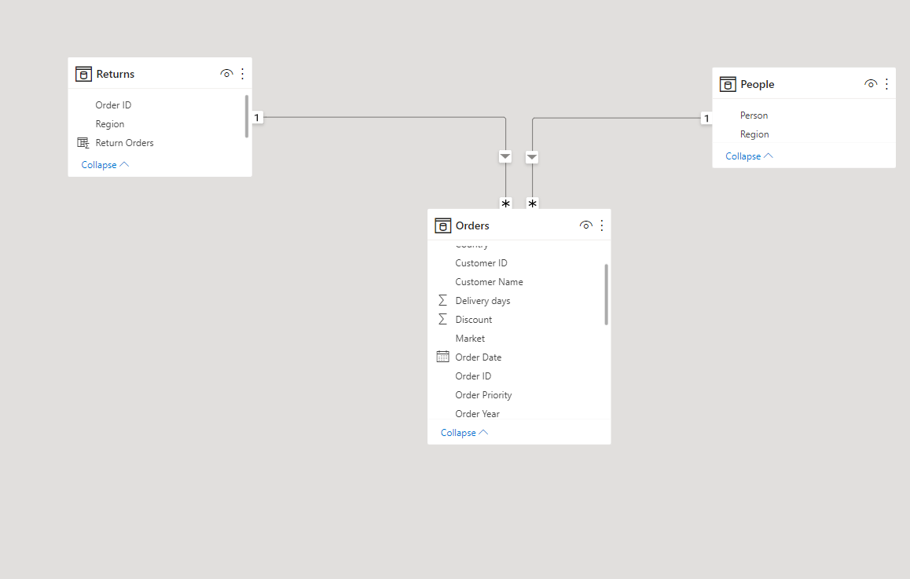
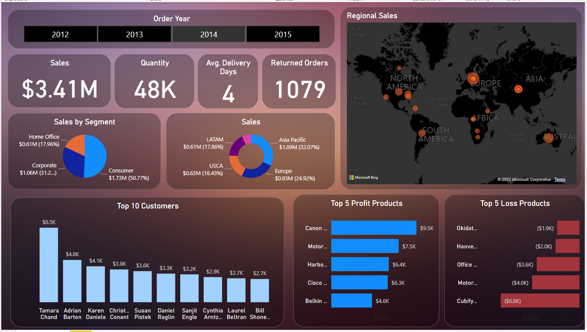
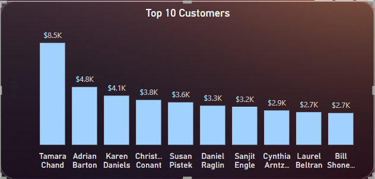

# Global Super Store: Sales Analysis for 2016

## Introduction

I came across the dataset online and admired how rich the data is as I have been trying to get my hands dirty with a very rich dataset to practice my skills of data cleaning, analysis and visualization.

**Power BI Concepts applied:**
- DAX Concepts:
                Calculated column,
                Custom Column,
                Year(),
                IF().
- Data Modelling: Star Schema (*:1)

----
## Problem Statement
- How long on average does an order take before delivery?
- What is the total sales made yearly since 2012? Has sales been on the increase since over the yers?
- Which of our customers are most important?
- Which of our products make the greatest profit and which products run the store into loss?
- Any other relevant data-driven insight into our sales. 
## Data Sourcing
Not until I came up with the above mentioned questions did I went ahead to get the data. I then downloaded the csv file, and extracted it into Power BI for clening, analysis and visualization.

It contains 3 sheets/tables:
1. ORDERS with 51,291 rows and 24 columns
2. PEOPLE with 24 rows and 2 columns
3. RETURNS with 1079 rows and 3 columns
----
## Data Transformation/Cleaning:
Data was efficiently cleaned and transformed with the Power Query Editor of Power BI.
[a screenshot of the applied steps]
Some of the applied steps included 

- Making first row as headers in the PEOPle and RETURN tables.
- Analytical transformation of the 'order table';
To have an idea of how long it takes on average for orders to be dilevered, [delivery days] need to be calculated.
 Using "custom columns", 
`delivery days = [shipped date] - [order date]`
- created new column for year of order date and named: [Order Year]
- ADDING conditional column to the 'Returns Table' to assign a numeric value to the Return response of YES and NO. If YES, then 1, else 0.
`Return Orders = IF(Returns[Returned] = "Yes", 1, 0)`
- Datatype then chnged from 'TEXT' TO 'WHOLE NUMBER'.

## DATA MODELLING
Power BI automatically connected related tables resulting in a star schema model.
The 'Order' table is the fact table of the model.
The remaining two dimension tables; 'Return' table and 'People' table are connected to the 'Order' table via the common columns: 'order ID' and Region respectively.

## Data Analysis and Visuals

1. From the dashboard, it is observed that it takes 4 days on average to deliver each product on every order.
2. Total sales made in 2012= 2.26M, 2013=2.68M ,2014=3.41M ,2015=4.30M.
3. Sales is highest in the Western Europe region with almost 450k dollars.

 Tamara Chand is the most valuable costumer by sales.
 
 ## conclusions & Recommendations
- An order takes 4days on average before delivery.
- There has been a gradual increase in the yearly sales since 2012 at the rate of approximately 19%.
- Different customers topped the profit list for each year.
- **Tamara Chand** has made the highest sales overall since 2012 to 2015. 
 However, on a yearly basis,
**Sanjit Chand** made the highest sale in 2012 with over 5.7k dollars while Tamara Chand could not make the top 10 sales for that year. 

In 2013;
 **Mike Gokenbach** made the higest sales with 4.8k dollars.

In 2014;
**Tamara chand** purchased products worth 8.5k.

In 2015;
**Raymond Buch** purchsed products worth $7.4k.

- **Canon Image (Class 2200) advance copier** made the highest profit in both 2014 and 2015.
Other Insights:
- The consumer segment has made more than 50% of the total sales. 
- Asia Pacific is the region with the highest sales.
 

